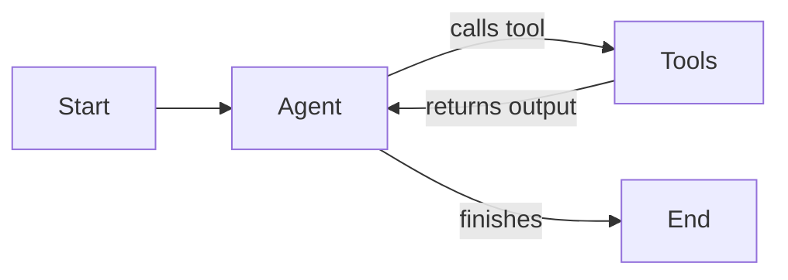

# Market Analysis Agent

An AI-powered market analysis agent for e-commerce products using LangGraph, FastAPI, and Google Gemini.

## Overview

This project implements an autonomous agent that analyzes market data for products by orchestrating specialized tools:

- **Product Scraper**: Collects pricing and availability data from e-commerce platforms
- **Competitor Analyzer**: Analyzes market competition and positioning
- **Sentiment Analyzer**: Evaluates customer reviews and sentiment
- **Report Generator**: Compiles comprehensive strategic reports

## Requirements

- Python 3.13
- Google API Key (for Gemini models)

## Installation

```bash
# Clone the repository
git clone https://github.com/damoursm/mathieu_damours_assignment.git
cd market-analysis-agent

# Create virtual environment
python -m venv venv
source venv/bin/activate  # On Windows: venv\Scripts\activate

# Install dependencies
pip install -r requirements.txt

# Configure environment
cp .env.example .env
```

## Configuration

Create a `.env` file with the following variables:

```env
GOOGLE_API_KEY=your-google-api-key-here
MODEL_NAME=gemini-1.5-flash
API_HOST=0.0.0.0
API_PORT=8000
DEBUG=false
```

## Usage

Run the API server:

```bash
python main.py
```

The API will be available at `http://localhost:8000`.

## API Endpoints

### 1. Health Check

Check if the API is running and healthy.

- **Endpoint**: `GET /api/v1/health`
- **Input**: None
- **Output**:
  ```json
  {
    "status": "healthy",
    "version": "1.0.0"
  }
  ```

### 2. Analyze Market

Trigger a market analysis for a specific product.

- **Endpoint**: `POST /api/v1/analyze`
- **Input**:
  ```json
  {
    "product_name": "string (required)",
    "analysis_type": "string (optional, default: 'full')",
    "include_recommendations": "boolean (optional, default: true)"
  }
  ```
  - `product_name`: The name of the product to analyze.
  - `analysis_type`: Type of analysis. Options: `full`, `product_only`, `competitor_only`, `sentiment_only`.
  - `include_recommendations`: Whether to include strategic recommendations in the report.

- **Output**:
  ```json
  {
    "success": true,
    "product_name": "string",
    "report": "string (markdown formatted report)",
    "steps_executed": int,
    "error": "string (optional)"
  }
  ```

## Architecture & Design Choices

### Tech Stack

- **FastAPI**: Chosen for its high performance, automatic OpenAPI documentation generation, and native support for asynchronous programming. It integrates seamlessly with Pydantic for data validation.
- **LangChain & LangGraph**:
  - **LangChain** is used for its robust abstractions around LLMs (specifically `langchain-google-genai`) and tool definitions.
  - **LangGraph** is used for orchestrating the agent's control flow. Unlike linear chains, LangGraph allows for stateful, cyclic workflows. This is crucial for an agent that needs to reason, loop back (e.g., if a tool fails or more info is needed), and maintain a persistent state (`AgentState`) throughout the execution.
- **Google Gemini**: The project uses Google's Gemini models for their strong reasoning capabilities and large context window, which is beneficial when processing aggregated market data.

### Agent Design

The agent follows a **ReAct** (Reasoning + Acting) pattern implemented as a state graph:

1.  **Agent Node**: The LLM receives the current state (messages) and decides whether to call a tool or finish.
2.  **Tools Node**: Executes the selected tool (Scraper, Competitor Analysis, Sentiment Analysis, Report Gen).
3.  **State Management**: `AgentState` keeps track of the conversation history, collected data, and execution steps.



## Project Structure

```
market-analysis-agent/
├── main.py                 # FastAPI application entry point
├── requirements.txt        # Python dependencies
├── Dockerfile             # Docker configuration
├── docker-compose.yml     # Docker Compose configuration
├── .env.example           # Environment variables template
├── src/
│   ├── config.py          # Application settings
│   ├── agent/
│   │   ├── graph.py       # LangGraph orchestration
│   │   └── state.py       # Agent state definition
│   ├── api/
│   │   ├── routes.py      # API endpoints
│   │   └── schemas.py     # Pydantic models
│   └── tools/
│       ├── base.py        # Base tool utilities
│       ├── product_scraper.py
│       ├── competitor_analyzer.py
│       ├── sentiment_analyzer.py
│       └── report_generator.py
└── tests/
    ├── conftest.py        # Test fixtures
    ├── test_tools.py      # Tool unit tests
    ├── test_agent.py      # Agent tests
    └── test_api.py        # API integration tests
```

## Testing

```bash
# Run all tests
pytest tests/ -v

# Run specific test files
pytest tests/test_tools.py -v
pytest tests/test_agent.py -v
pytest tests/test_api.py -v

# Run with coverage
pytest tests/ -v --cov=src
```

## Docker

```bash
# Build and run with Docker Compose
docker-compose up --build

# Or build manually
docker build -t market-analysis-agent .
docker run -p 8000:8000 --env-file .env market-analysis-agent
```

## License

MIT
