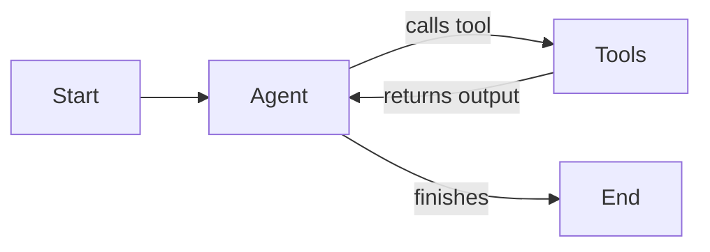

# Market Analysis Agent

An AI-powered market analysis agent for e-commerce products using LangGraph, FastAPI, and Google Gemini.

## Overview

This project implements an autonomous agent that analyzes market data for products by orchestrating specialized tools:

- **Product Scraper**: Collects pricing and availability data from e-commerce platforms
- **Competitor Analyzer**: Analyzes market competition and positioning
- **Sentiment Analyzer**: Evaluates customer reviews and sentiment
- **Report Generator**: Compiles comprehensive strategic reports

## Requirements

- Python 3.13
- Google API Key (for Gemini models)

## Installation

```bash
# Clone the repository
git clone https://github.com/damoursm/mathieu_damours_assignment.git
cd market-analysis-agent

# Create virtual environment
python -m venv venv
source venv/bin/activate  # On Windows: venv\Scripts\activate

# Install dependencies
pip install -r requirements.txt

# Configure environment
cp .env.example .env
```

## Configuration

Create a `.env` file with the following variables:

```env
GOOGLE_API_KEY=your-google-api-key-here
MODEL_NAME=gemini-1.5-flash
API_HOST=0.0.0.0
API_PORT=8000
DEBUG=false
```

## Usage

Run the API server:

```bash
python main.py
```

The API will be available at `http://localhost:8000`.

## API Endpoints

### 1. Health Check

Check if the API is running and healthy.

- **Endpoint**: `GET /api/v1/health`
- **Input**: None
- **Output**:
  ```json
  {
    "status": "healthy",
    "version": "1.0.0"
  }
  ```

### 2. Analyze Market

Trigger a market analysis for a specific product.

- **Endpoint**: `POST /api/v1/analyze`
- **Input**:
  ```json
  {
    "product_name": "string (required)",
    "analysis_type": "string (optional, default: 'full')",
    "include_recommendations": "boolean (optional, default: true)"
  }
  ```
  - `product_name`: The name of the product to analyze.
  - `analysis_type`: Type of analysis. Options: `full`, `product_only`, `competitor_only`, `sentiment_only`.
  - `include_recommendations`: Whether to include strategic recommendations in the report.

- **Output**:
  ```json
  {
    "success": true,
    "product_name": "string",
    "report": "string (markdown formatted report)",
    "steps_executed": int,
    "error": "string (optional)"
  }
  ```

## Architecture & Design Choices

### Tech Stack

- **FastAPI**: Chosen for its high performance, automatic OpenAPI documentation generation, and native support for asynchronous programming. It integrates seamlessly with Pydantic for data validation.
- **LangChain & LangGraph**:
  - **LangChain** is used for its robust abstractions around LLMs (specifically `langchain-google-genai`) and tool definitions.
  - **LangGraph** is used for orchestrating the agent's control flow. Unlike linear chains, LangGraph allows for stateful, cyclic workflows. This is crucial for an agent that needs to reason, loop back (e.g., if a tool fails or more info is needed), and maintain a persistent state (`AgentState`) throughout the execution.
- **Google Gemini**: The project uses Google's Gemini models for their strong reasoning capabilities and large context window, which is beneficial when processing aggregated market data.

### Agent Design

The agent follows a **ReAct** (Reasoning + Acting) pattern implemented as a state graph:

1.  **Agent Node**: The LLM receives the current state (messages) and decides whether to call a tool or finish.
2.  **Tools Node**: Executes the selected tool (Scraper, Competitor Analysis, Sentiment Analysis, Report Gen).
3.  **State Management**: `AgentState` keeps track of the conversation history, collected data, and execution steps.



## Project Structure

```
market-analysis-agent/
├── main.py                 # FastAPI application entry point
├── requirements.txt        # Python dependencies
├── Dockerfile             # Docker configuration
├── docker-compose.yml     # Docker Compose configuration
├── .env.example           # Environment variables template
├── src/
│   ├── config.py          # Application settings
│   ├── agent/
│   │   ├── graph.py       # LangGraph orchestration
│   │   └── state.py       # Agent state definition
│   ├── api/
│   │   ├── routes.py      # API endpoints
│   │   └── schemas.py     # Pydantic models
│   └── tools/
│       ├── base.py        # Base tool utilities
│       ├── product_scraper.py
│       ├── competitor_analyzer.py
│       ├── sentiment_analyzer.py
│       └── report_generator.py
└── tests/
    ├── conftest.py        # Test fixtures
    ├── test_tools.py      # Tool unit tests
    ├── test_agent.py      # Agent tests
    └── test_api.py        # API integration tests
```

## Testing

```bash
# Run all tests
pytest tests/ -v

# Run specific test files
pytest tests/test_tools.py -v
pytest tests/test_agent.py -v
pytest tests/test_api.py -v

# Run with coverage
pytest tests/ -v --cov=src
```

## Docker

```bash
# Build and run with Docker Compose
docker-compose up --build

# Or build manually
docker build -t market-analysis-agent .
docker run -p 8000:8000 --env-file .env market-analysis-agent
```

## 4: Data Architecture and Storage

### Technology Justification
#### PostgreSQL
- Free and open source. I would use PostgreSQL first and reevaluate in the longer if we should change. 
- SQL is easy to use and enables aggregations, filtering, and reporting across historical data (cold data that isn't accessed often). 

#### Redis
- Sub-millisecond latency: Good to handle frequently accessed, short-lived data (hot data)
- TTL support: Automatic expiration prevents stale data
- Reduces external API calls: Caches scraped data to minimize requests


### 4.1 Analysis Results Storage
class AnalysisResult:

    id: UUID                    # Primary key
    product_name: str           # Indexed for fast lookups
    analysis_type: Enum         # full, product_only, competitor_only, sentiment_only
    product_data: JSONB         # Scraped product information
    competitor_data: JSONB      # Competitive analysis results
    sentiment_data: JSONB       # Customer sentiment metrics
    report: TEXT                # Generated markdown report
    created_at: timestamp       # Indexed for time-based queries
    confidence_score: float     # Analysis reliability metric
    execution_time_ms: int      # Performance tracking


### 4.2 Request History
class RequestHistory:

    id: UUID                    # Primary key
    user_id: str                # Indexed for user-specific queries
    product_name: str           # Search term used
    request_params: JSONB       # Full request configuration
    status: Enum                # pending, completed, failed
    created_at: timestamp       # Request initiation time
    completed_at: timestamp     # Nullable, completion time
    error_message: TEXT         # Nullable, failure details


### 4.3 Cache Schema (Redis)
#### Key patterns with TTL

"product:{product_name}:data"      -> TTL 1 hour
"competitor:{product_name}:data"   -> TTL 2 hours
"sentiment:{product_name}:data"    -> TTL 30 minutes
"report:{product_name}:hash"       -> TTL 24 hours

### 4.3 Cache Schema (Redis)
#### Key patterns with TTL

"product:{product_name}:data"      -> TTL 1 hour
"competitor:{product_name}:data"   -> TTL 2 hours
"sentiment:{product_name}:data"    -> TTL 30 minutes
"report:{product_name}:hash"       -> TTL 24 hours


### 4.4 Agent Configuration
class AgentConfig:

    id: UUID                    # Primary key
    agent_name: str             # Unique identifier
    model_name: str             # LLM model (e.g., claude-sonnet-4-20250514)
    temperature: float          # Response creativity setting
    max_tokens: int             # Output length limit
    tool_settings: JSONB        # Tool-specific parameters
    enabled: bool               # Active status
    updated_at: timestamp       # Last modification time


## 5: Monitoring and Observability

To ensure the reliability and performance of the agent system in production, We need to implement a comprehensive monitoring strategy focusing on tracing, metrics, alerting, and quality assurance. 

### Tracing

-   **LangSmith Integration**: Since we are using LangGraph, LangSmith is the native choice for deep tracing. It allows us to:
    -   Visualize the full chain of thought (Agent -> Tool -> Agent).
    -   Inspect inputs and outputs at every step (LLM calls, tool executions).
    -   Debug loops or unexpected tool usage.

### Performance Metrics

We collect quantitative data to monitor system health.

-   **System Metrics**: CPU/Memory usage of containers, API latency (p95, p99), Request throughput (RPS).
-   **Agent Metrics**:
    -   `agent_execution_time`: Total time from request to final report.
    -   `tool_usage_count`: Frequency of each tool (Scraper, Sentiment, etc.).
    -   `token_usage`: Input/Output tokens per run (cost monitoring).
    -   `steps_per_run`: Number of graph steps (detects infinite loops).

### Alerting Strategy

We define alerts based on thresholds to proactively detect issues.

-   **Critical Alerts (PagerDuty/Slack)**:
    -   API Availability < 99.9%.
    -   Agent Error Rate > 5% (e.g., tool failures, LLM exceptions).
    -   P99 Latency > 30s (timeout risks).
-   **Warning Alerts**:
    -   Unusual token spikes (cost anomaly).
    -   High rate of "I don't know" or fallback responses.

### Quality Assurance & Evaluation

QA is in this case about the *quality* of the analysis.

-   **Feedback Loop**: Implement a simple feedback mechanism (thumbs up/down) on the generated reports to calculate a CSAT score.
-   **LLM-as-a-Judge**: Periodically sample generated reports and use a stronger model (e.g., Claude Opus 4.6) to grade them based on:
    -   **Relevance**: Did it answer the user's specific product query?
    -   **Completeness**: Did it use all requested tools?
    -   **Hallucination Check**: Cross-reference cited prices/stats with raw tool outputs.

## Task 6: Scaling and Optimization

To handle high concurrency (100+ simultaneous analyses) and optimize costs, we propose a scalable architecture leveraging asynchronous processing, caching, and smart LLM usage.

### Handling Peak Loads (Async Architecture)

Direct synchronous HTTP requests will timeout under heavy load. We move to an **asynchronous task queue pattern**.

-   **Architecture**:
    1.  **API Layer**: Receives request -> Pushes job to Redis Queue -> Returns `job_id` immediately (202 Accepted).
    2.  **Worker Pool**: Scalable pool of Python workers consumes jobs from Redis.


### Cost Optimization

LLM costs can skyrocket with high volume and more performant models.

-   **Tiered Model Strategy**:
    -   **Router/Classifier**: Use a cheap model (Gemini Flash) to classify the request complexity.
    -   **Simple Queries**: Route to cheaper models.
    -   **Complex Analysis**: Route to powerful models (Gemini 3 Pro / Claude Opus 4.6) only when deep reasoning is needed.
-   **Prompt Optimization**:
    -   **Context Pruning**: Summarize tool outputs before passing them to the final report generator to reduce input tokens.
    -   **Structured Output**: Reduce verbose "chatty" responses using JSON like bullet points.

### Intelligent Caching System

Avoid redundant computations and API calls.

-   **Semantic Caching (GPTCache)**:
    -   Instead of exact string matching, use vector embeddings to find similar queries (e.g., "iPhone 17 analysis" ≈ "market report for iPhone 17").
    -   If similarity > threshold, return the cached report.
-   **Tool-Level Caching**:
    -   Cache the results of expensive tools (e.g., Scraper) in Redis with a TTL (e.g., 24h).
    -   If a user requests the same product within 24h, skip the scraping step and use cached data.

### Parallelization (Map-Reduce)

Speed up analysis by running independent tasks concurrently.

-   **LangGraph Parallel Branches**:
    -   The "Competitor Analysis" and "Sentiment Analysis" steps are independent.
    -   We can modify the graph to execute these nodes in parallel rather than sequentially.
    -   **Fan-out**: Agent triggers multiple tools at once.
    -   **Fan-in**: A "Reducer" node waits for all outputs before generating the final report.


## Task 7: Continuous Improvement and A/B Testing

To ensure the agent evolves and improves over time, we implement a structured process for evaluation, experimentation, and feedback integration.

### Automated Evaluation (LLM as Judge)

Manually reviewing every report is impossible at scale. We use an automated evaluation pipeline based on an LLM as Judge approach where a more performant (and pricier) 
LLM can judge a subset of the queries responses.

-   **Golden Dataset**: Create a curated set of 50+ diverse product queries with "ideal" human-written reports.
-   **Evaluation Metrics**:
    -   **Faithfulness**: Does the report contradict the tool outputs?
    -   **Answer Relevance**: Is the report useful for the user's intent?
-   **Implementation**: Examples of frameworks like **DeepEval** or **Ragas** can be run in the CI/CD pipelines. If a code change drops the score below a threshold, the deployment is blocked.

### Prompt Engineering A/B Testing

We treat prompts as code and test them using A/B testing.

-   **Experiment Setup**:
    -   **Variant A (Control)**: Current production prompt.
    -   **Variant B (Challenger)**: New prompt (e.g., "Act as a senior strategist" vs "Act as a data analyst").
-   **Traffic Splitting**: Route 10% of traffic to Variant B.
-   **Success Metrics**: Compare "Thumbs Up" rate (the manual feedback) and "Session Length" between A and B.
-   **LangSmith Experiments**: Run offline batch tests against the Golden Dataset to compare Variant A vs B before rolling out to production.

### User Feedback Loop

Direct user feedback is the strongest signal for improvement.

-   **Explicit Feedback**:
    -   Add a feedback buttons with thumbs up and down to every generated report.
    -   If the thumbs down is clicked, ask for a reason (e.g., "Too generic", "Inaccurate price").
-   **Implicit Feedback**:
    -   Track "Copy to Clipboard" or "Share" actions as positive signals.
-   **Data Flywheel**:
    -   Store negative feedback examples in a "Hard Examples" dataset.
    -   Use these examples to fine-tune the prompt or add new few-shot examples to the agent's context.

### Evolving Agent Capabilities

We use a "Skill Acquisition" framework to add new capabilities safely.

1.  **Identify Gaps**: Analyze "I don't know" responses or tool errors to find missing skills (e.g., "Can't find shipping costs").
2.  **Develop New Tool**: Create a specific tool (e.g., `shipping_calculator`).
3.  **Shadow Mode Deployment**:
    -   Deploy the new agent version but don't show its output to users yet.
    -   Run it in parallel with the production agent.
    -   Compare the outputs: Does the new tool add value without breaking existing logic?
4.  **Full Rollout**: Once validated in Shadow Mode, release to 100% of users.
